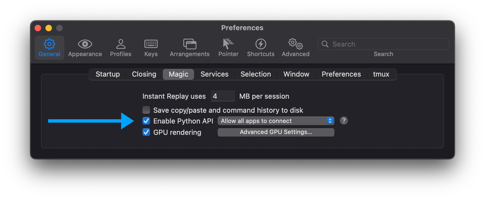

## NOTE (fall 2022)

I finally took some time to rewrite `i2cssh` in python. For a while now Iterm2 has had a python API that allows you to automate a bunch of stuff. This python implementation uses that API to do the same thing as the original ruby script. This should make this app more maintainable, since it doesn't rely on any weird AppleScript bindings and emitting key codes. Secondly, it should be quite a bit faster in generating the ssh windows.

I've regained new interest, so if you find a bug, please report! Make sure to include your configuration!

# i2cssh

`i2cssh` is a csshX (http://code.google.com/p/csshx/) like tool for connecting ssh to multiple machines using ssh. But instead of creating separate windows and having a master window for input, `i2cssh` uses [Iterm2](https://iterm2.com/) split panes and allows to "Send input to all sessions" (⌘-shift-I) to send commands to all sessions.


## Features

- Opening sessions in the current or new tabs
- Multiple cluster configuration
- Enable broadcast by default
- Multiple profiles
- Configurable SSH and shell parameters
- Custom layouts

## Installing

    $ brew install wouterdebie/repo/i2cssh

Make sure to enable the Python API in Iterm2. Go to Preferences -> General -> Magic -> Enable Python API.



## Usage

    Usage: i2cssh [OPTIONS] [HOSTS_OR_CLUSTER]...

    HOSTS: [(login@host [login@host] | login@cluster)]

    Options:
    General options:
        -c, --clusters TEXT           Comma-separated list of clusters specified
                                      in ~/.i2csshrc
        -m, --machines TEXT           Comma-separated list of hosts
        -f, --file TEXT               Cluster file (one hostname per line)
        -t, --tab-split               Split servers/clusters into tabs and put all
                                      hosts specified on the command line in one
                                      tab
        -T, --tab-split-nogroup       Split servers/clusters into tabs and put
                                      each host specified on the command line in a
                                      separate tab
        -W, --same-window             Use existing window for spawning new tabs
        -v, --version                 Show version
    SSH options:
        -A, --forward-agent           Enable SSH agent forwarding
        -l, --login TEXT              SSH user name
        -e, --environment TEXT        Send environment vars (comma-separated list,
                                      need to start with LC_)
        -r, --rank                    Send LC_RANK with the host number as
                                      environment variable
        -X, --extra TEXT              Additional ssh parameters (e.g.
                                      -Xi=myidentity.pem)
        -g, --gateway TEXT            Multihop SSH connection gateway string (e.g.
                                      username@gateway) - usually used with -A
    iTerm2 options:
        -F, --fullscreen              Make the window fullscreen
        -b, --broadcast               Start with broadcast input (DANGEROUS!)
        -nb, --nobroadcast            Disable broadcast input
        -p, --profile TEXT            iTerm2 profile name (default: Default)
        -s, --sleep INTEGER           Number of seconds to sleep between creating
                                      SSH sessions
        -S, --shell TEXT              Shell to use when spawning the SSH sessions
                                      (default: bash)
        -d, --direction [column|row]  Direction that new sessions are created
                                      (default: column)
    Layout: [mutually_exclusive]
        -C, --columns INTEGER         Number of columns (rows will be calculated)
        -R, --rows INTEGER            Number of rows (columns will be calculated)
    --help                            Show this message and exit.

`i2cssh` will assume you want to connect to a cluster when only one host is given.

For `-c` and `-m` options, the format `username@cluster` or `username@host` can be used.

The following commands are exactly the same, however, they might serve different purposes:

    $ i2cssh -m user1@host1,user2@host2
    $ i2cssh user1@host1 user2@host2

You can combine these options and use them multiple times:

    $ i2cssh -m user1@host1,user2@host2 user4@host3 user5@host4

Using the `-l` option will override all usernames:

    $ i2cssh -l foo user1@host1 user2@host2

This will connect to both `host1` and `host2` as the user `foo`

## i2csshrc

The `i2csshrc` file is a YAML formatted file that contains the following structure:

```yaml
---
version: 2
[optional parameters]
clusters:
    mycluster:
    [optional parameters]
    hosts:
        - host1
        - host2
```

Optional parameters can be used globally or per cluster and include:

```yaml
broadcast: (true/false) # Enable/disable broadcast on start
login: <username> # Use this username for login
profile: <iTerm2 profile> # Use this iTerm profile
rank: (true/false) # Enable sending LC_RANK as an environment variable
columns: <cols> # Amount of columns
rows: <rows> # Amount of rows
sleep: <secs> # Seconds to sleep between creating SSH sessions
direction: (column/row) # Direction that new sessions are created (default: column)
shell: <shell> # Shell to use (default: /bin/bash)

environment: # Send the following enviroment variables
  - LC_FOO: foo
  - LC_BAR: bar
```

Note: rows and columns can't be used at the same time.

The following precedence is used:

`global options from config` < `cluster options from config` < `command line flags`

Make sure the config file is valid YAML (e.g. use spaces instead of tabs)

## Options

| Option                                    | Description                                                                                                                                                                                                                    |
| ----------------------------------------- | ------------------------------------------------------------------------------------------------------------------------------------------------------------------------------------------------------------------------------ |
| <nobr>`-A, --forward-agent`</nobr>        | Enable SSH agent forwarding                                                                                                                                                                                                    |
| <nobr>`-l, --login LOGIN`</nobr>          | This option will override all logins passed in to i2cssh. This goes for global config, cluster config or username@host passed on the command line.                                                                             |
| <nobr>`-e, --environment KEY=VAL`</nobr>  | Allows for passing environment varables to the SSH session. This can be a comma-separated list: `-e LC_FOO=foo,LC_BAR=bar`                                                                                                     |
| <nobr>`-F, --fullscreen`</nobr>           | Enable fullscreen on startup.                                                                                                                                                                                                  |
| <nobr>`-C, --columns COLUMNS`</nobr>      | Set the amount of columns. Can't be used in conjunction with `-R`.                                                                                                                                                             |
| <nobr>`-R, --rows ROWS`</nobr>            | Set the amount of columns. Can't be used in conjunction with `-C`.                                                                                                                                                             |
| <nobr>`-b, --broadcast`</nobr>            | Enable broadcast on startup.                                                                                                                                                                                                   |
| <nobr>`-nb, --nobroadcast`</nobr>         | Disable broadcast. This setting can be used to disable any broadcast that was set in the config.                                                                                                                               |
| <nobr>`-p, --profile PROFILE`</nobr>      | Use a specific iTerm profile.                                                                                                                                                                                                  |
| <nobr>`-f, --file FILE`</nobr>            | Will read nodes from a file. These will be added to any hosts specified on the command line or in the config.                                                                                                                  |
| <nobr>`-c, --clusters clus1,clus2`</nobr> | Connect to one or more clusters that are specified in the config.                                                                                                                                                              |
| <nobr>`-r, --rank`</nobr>                 | Send a LC_RANK environment variable different for each host (from 0 to n).                                                                                                                                                     |
| <nobr>`-m, --machines a,b,c`</nobr>       | Connect to the machines a, b and c                                                                                                                                                                                             |
| <nobr>`-t, --tab-split`</nobr>            | Split servers/clusters into tabs, grouping arguments. Tabs are created as follows: hosts after a -m option are put in one tab, each cluster is always in its own tab, all the arguments are in one tab.                        |
| <nobr>`-T, --tab-split-nogroup`</nobr>    | Split servers/clusters into tabs, _not_ grouping arguments. Tabs are created as follows: hosts after a -m option are put in one tab, each cluster is always in its own tab, each argument is in its own tab.                   |
| <nobr>`-W, --same-window`</nobr>          | Do not create new Window, but spawn new cluster tabs in current (last used) iterm window.                                                                                                                                      |
| <nobr>`-s, --sleep SLEEP`</nobr>          | Wait SLEEP seconds between starting each ssh session. This will take decimals as well (0.5 for half a second)                                                                                                                  |
| <nobr>`-X, --extra EXTRA`</nobr>          | Set extra ssh parameters in the form `-Xk=v` <br><br>E.g: `i2cssh -Xi=myidentity.pem` will result in `ssh -i myidentity.pem`, or `i2cssh -Xp=2222 -XL=8080:localhost:8080` will result in `ssh -p 2222 -L 8080:localhost:8080` |

## TODO

- Better release process (homebrew update after new release)
- Proper handling of resizing and full screen when the window is too small for the amount of rows or columns.

## Contributing to i2cssh

I know that `i2cssh` doesn't have all the functionality of csshX, but either let me know what you really need or fork, hack and create a pull request.

- Check out the latest master to make sure the feature hasn't been implemented or the bug hasn't been fixed yet
- Check out the issue tracker to make sure someone already hasn't requested it and/or contributed it
- Fork the project
- Start a feature/bugfix branch
- Commit and push until you are happy with your contribution

## Copyright

Copyright (c) 2011-2022 Wouter de Bie. See LICENSE.txt for
further details.
